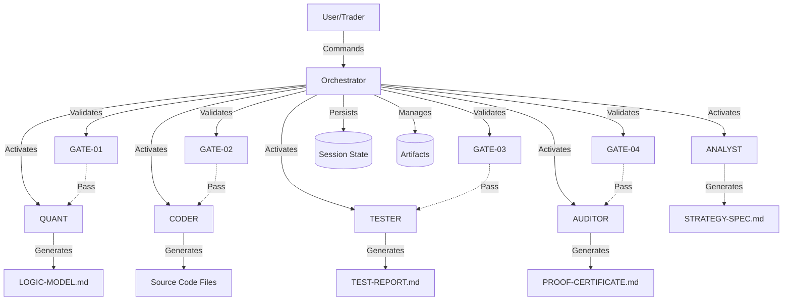
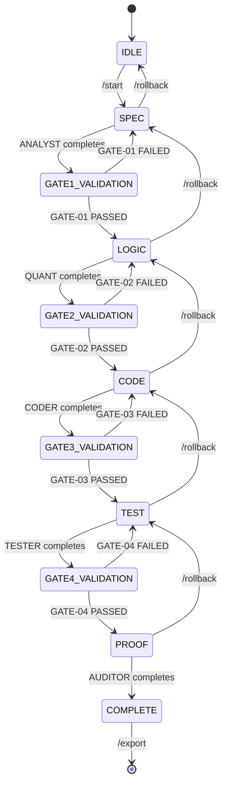
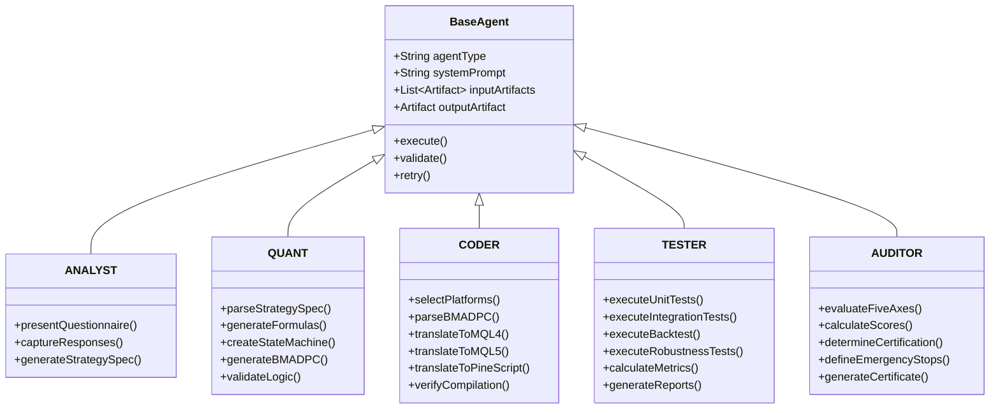
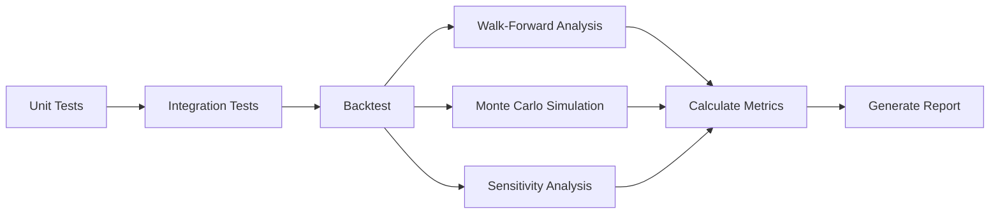

# BMAD-Trading System Design Document

**Version:** v1.0  
**Date:** 2024  
**Status:** Draft

## Overview

The BMAD-Trading System is a rigorous, agent-based framework for developing trading strategies with complete traceability from concept to deployment. The system enforces a philosophy of "proof before code" through a structured workflow with mandatory quality gates.

### System Purpose

The system transforms trading ideas into statistically validated, production-ready code through five specialized phases:
1. **SPEC Phase**: Capture trading ideas through structured questionnaires
2. **LOGIC Phase**: Transform specifications into mathematical models
3. **CODE Phase**: Generate platform-specific executable code
4. **TEST Phase**: Execute comprehensive testing (unit, integration, backtest, robustness)
5. **PROOF Phase**: Perform statistical certification and risk assessment

### Key Design Principles

- **Traceability**: Every code element traces back to a specific requirement (Rule_ID)
- **Quality Gates**: Four mandatory checkpoints ensure quality at each phase
- **Agent Specialization**: Each agent has a focused responsibility with specialized prompts
- **Platform Agnostic**: Logic is expressed in BMAD_PC pseudo-code before platform translation
- **Statistical Rigor**: Strategies must pass 18 performance metrics and 5-axis evaluation
- **Immutable Workflow**: Phases execute sequentially; rollback is the only way to revise

### Core Components

1. **Orchestrator**: CLI interface, state machine, gate validator, agent coordinator
2. **Five Specialized Agents**: ANALYST, QUANT, CODER, TESTER, AUDITOR
3. **Artifact System**: Versioned documents with templates and validation
4. **Translation Engine**: BMAD_PC to platform-specific code generation
5. **Testing Framework**: Multi-level testing with metric calculation
6. **Certification System**: Statistical evaluation and risk scoring


## Architecture

### High-Level Architecture



### System Layers

**Layer 1: User Interface**
- Command-line interface (CLI)
- Command parser and dispatcher
- Status display and reporting

**Layer 2: Orchestration**
- State machine (phase transitions)
- Gate validation engine
- Agent activation and coordination
- Session persistence

**Layer 3: Agent Execution**
- LLM integration layer
- Prompt management system
- Artifact generation and validation
- Template application

**Layer 4: Code Generation**
- BMAD_PC parser
- Translation tables (MT4/MT5/Pine Script)
- Platform-specific code generators
- Compilation verification

**Layer 5: Testing & Certification**
- Test execution engine
- Metric calculation modules
- Statistical evaluation
- Report generation

**Layer 6: Data & Persistence**
- File system operations
- Artifact versioning
- State serialization
- Audit trail logging


### State Machine Design

The orchestrator implements a finite state machine controlling workflow progression:



**State Transitions:**
- Forward transitions require gate passage
- Rollback transitions preserve artifacts and increment versions
- Each state activates a specific agent
- State persists to disk after each transition

### Agent Architecture

All agents share a common architecture with specialized implementations:




## Components and Interfaces

### Orchestrator Component

**Responsibilities:**
- Parse and dispatch user commands
- Manage state machine transitions
- Activate agents with appropriate context
- Validate gates with checklist criteria
- Persist session state and artifacts
- Generate traceability maps and audit trails

**Key Interfaces:**

```python
class Orchestrator:
    def execute_command(command: str) -> CommandResult
    def transition_phase(target_phase: Phase) -> bool
    def validate_gate(gate_number: int) -> GateResult
    def activate_agent(agent_type: AgentType) -> Agent
    def persist_state() -> bool
    def restore_state() -> SessionState
    def generate_traceability_map() -> TraceabilityMap
    def export_deployment_package() -> str
```

**Command Handlers:**
- `/start`: Initialize new session, transition to SPEC phase
- `/status`: Display current phase, agent, gate status
- `/gate`: Display current gate checklist with pass/fail status
- `/rollback`: Transition to previous phase, increment artifact versions
- `/agent`: Display active agent information
- `/spec`, `/logic`, `/code`, `/test`, `/proof`: Display respective artifacts
- `/export`: Package all artifacts into deployment ZIP
- `/audit`: Display traceability map and audit trail
- `/checklist`: Display all gate checklists

### Agent Base Component

**Responsibilities:**
- Receive activation from orchestrator
- Access input artifacts from previous phases
- Execute specialized task via LLM integration
- Generate output artifact conforming to template
- Validate output against quality criteria
- Retry on validation failure (up to 3 attempts)

**Key Interfaces:**

```python
class BaseAgent:
    def activate(context: AgentContext) -> None
    def execute() -> Artifact
    def validate_output(artifact: Artifact) -> ValidationResult
    def retry_with_feedback(feedback: str) -> Artifact
    def get_system_prompt() -> str
    def get_template() -> Template
```

### LLM Integration Component

**Responsibilities:**
- Manage connections to Claude and GPT APIs
- Construct prompts with system instructions and context
- Stream responses and handle errors
- Log all interactions for audit trail
- Implement retry logic with exponential backoff

**Key Interfaces:**

```python
class LLMIntegration:
    def send_prompt(system_prompt: str, user_prompt: str, 
                   context: List[Artifact]) -> str
    def validate_response(response: str, schema: Schema) -> bool
    def log_interaction(prompt: str, response: str) -> None
    def configure_provider(provider: LLMProvider) -> None
```


### Gate Validation Component

**Responsibilities:**
- Maintain checklist definitions for all four gates
- Execute validation checks against artifacts
- Report specific failures with error messages
- Track gate status (PENDING, IN_PROGRESS, PASSED, FAILED)
- Prevent phase transitions when gates fail

**Gate Definitions:**

**GATE-01 (9 criteria):**
1. All mandatory sections present in STRATEGY_SPEC
2. Each rule has unique Rule_ID
3. Entry rules clearly defined
4. Exit rules clearly defined
5. Risk management rules specified
6. Market context documented
7. Edge cases identified
8. Examples provided for key rules
9. Artifact saved with correct filename

**GATE-02 (7 criteria):**
1. All rules from STRATEGY_SPEC represented in LOGIC_MODEL
2. All formulas mathematically valid
3. State machine has no unreachable states
4. All variables defined with types and ranges
5. BMAD_PC pseudo-code syntactically correct
6. Truth tables cover all input combinations
7. Artifact saved with correct filename

**GATE-03 (6 criteria):**
1. Code compiles without errors on target platform
2. All Rule_IDs from LOGIC_MODEL present in code comments
3. Code structure follows standardized template
4. Error handling implemented
5. All variables from LOGIC_MODEL declared in code
6. Artifact saved with correct filename

**GATE-04 (7 criteria):**
1. All unit tests passed
2. All integration tests passed
3. Backtest includes at least 100 trades (configurable)
4. All 18 backtest metrics calculated
5. Walk-Forward Analysis performed
6. Monte Carlo Simulation performed
7. Artifact saved with correct filename

**Key Interfaces:**

```python
class GateValidator:
    def validate_gate(gate_number: int, artifacts: List[Artifact]) -> GateResult
    def check_criterion(criterion_id: str, artifact: Artifact) -> bool
    def get_checklist(gate_number: int) -> List[Criterion]
    def get_failure_messages(gate_result: GateResult) -> List[str]
```

### Artifact Management Component

**Responsibilities:**
- Apply templates to new artifacts
- Validate artifact structure and content
- Version artifacts (v1.0, v1.1, etc.)
- Save artifacts to file system
- Load artifacts for agent consumption
- Track artifact metadata (timestamps, versions, file paths)

**Artifact Types:**
1. STRATEGY-SPEC.md
2. LOGIC-MODEL.md
3. [strategy_name]_MT4.mq4
4. [strategy_name]_MT5.mq5
5. [strategy_name]_Pine.pine
6. TEST-REPORT.md
7. PROOF-CERTIFICATE.md
8. TRACEABILITY-MAP.md
9. AUDIT-TRAIL.md
10. README.md

**Key Interfaces:**

```python
class ArtifactManager:
    def create_artifact(artifact_type: ArtifactType, 
                       template: Template) -> Artifact
    def save_artifact(artifact: Artifact) -> str
    def load_artifact(file_path: str) -> Artifact
    def version_artifact(artifact: Artifact) -> Artifact
    def validate_structure(artifact: Artifact, 
                          template: Template) -> bool
    def get_artifact_metadata(artifact: Artifact) -> Metadata
```


### Translation Engine Component

**Responsibilities:**
- Parse BMAD_PC pseudo-code into abstract syntax tree (AST)
- Maintain translation tables for MT4, MT5, Pine Script
- Translate BMAD_PC constructs to platform-specific syntax
- Handle platform-specific idioms and limitations
- Preserve Rule_ID traceability in generated code
- Apply platform-specific code templates

**BMAD_PC Language Specification:**

**Keywords:** IF, THEN, ELSE, WHILE, FOR, FUNCTION, RETURN, AND, OR, NOT

**Operators:** +, -, *, /, %, ^, <, >, <=, >=, ==, !=

**Market Data Functions:**
- CLOSE(offset), OPEN(offset), HIGH(offset), LOW(offset), VOLUME(offset)

**Indicator Functions:**
- SMA(period), EMA(period), RSI(period), MACD(fast, slow, signal), ATR(period)

**Translation Table Structure:**

```python
translation_tables = {
    "MT4": {
        "CLOSE": "Close[{offset}]",
        "SMA": "iMA(NULL, 0, {period}, 0, MODE_SMA, PRICE_CLOSE, {offset})",
        "IF": "if ({condition})",
        "AND": "&&",
        # ... complete mappings
    },
    "MT5": {
        "CLOSE": "iClose(NULL, 0, {offset})",
        "SMA": "iMA(NULL, 0, {period}, 0, MODE_SMA, PRICE_CLOSE)",
        "IF": "if ({condition})",
        "AND": "&&",
        # ... complete mappings
    },
    "Pine": {
        "CLOSE": "close[{offset}]",
        "SMA": "ta.sma(close, {period})",
        "IF": "if {condition}",
        "AND": "and",
        # ... complete mappings
    }
}
```

**Key Interfaces:**

```python
class TranslationEngine:
    def parse_bmad_pc(pseudo_code: str) -> AST
    def translate_to_platform(ast: AST, platform: Platform) -> str
    def apply_code_template(code: str, platform: Platform) -> str
    def insert_traceability_comments(code: str, 
                                    rule_mappings: Dict) -> str
    def validate_syntax(code: str, platform: Platform) -> bool
```

### Testing Framework Component

**Responsibilities:**
- Execute unit tests for individual functions
- Execute integration tests with predefined scenarios
- Execute backtests on historical data
- Execute robustness tests (Walk-Forward, Monte Carlo, Sensitivity)
- Calculate 18 performance metrics
- Generate equity curves and trade distributions
- Produce comprehensive test reports

**Test Execution Flow:**



**Key Interfaces:**

```python
class TestingFramework:
    def execute_unit_tests(code: str, test_cases: List[TestCase]) -> UnitTestResults
    def execute_integration_tests(code: str, scenarios: List[Scenario]) -> IntegrationTestResults
    def execute_backtest(code: str, data: MarketData, config: BacktestConfig) -> BacktestResults
    def execute_walk_forward(code: str, data: MarketData, periods: int) -> WalkForwardResults
    def execute_monte_carlo(trades: List[Trade], iterations: int) -> MonteCarloResults
    def execute_sensitivity_analysis(code: str, parameters: List[Parameter]) -> SensitivityResults
    def calculate_metrics(trades: List[Trade]) -> Metrics
    def generate_equity_curve(trades: List[Trade]) -> Image
    def generate_trade_distribution(trades: List[Trade]) -> Image
```


### Certification Component

**Responsibilities:**
- Evaluate strategy on five axes (Edge, Robustness, Risk, Compliance, Exploitability)
- Calculate scores using defined thresholds
- Determine certification status (CERTIFIED, CONDITIONAL, REJECTED, ABANDONED)
- Define emergency stop criteria
- Generate certification documentation
- Create post-certification monitoring plan

**Five-Axis Evaluation:**

**Edge Axis (0-4 points):**
- Measures profitability and win consistency
- Based on Profit_Factor and Win_Rate
- 4 points: PF ≥ 2.0 AND WR ≥ 50%
- 3 points: PF ≥ 1.5 AND WR ≥ 45%
- 2 points: PF ≥ 1.2 AND WR ≥ 40%
- 1 point: PF ≥ 1.0 AND WR ≥ 35%

**Robustness Axis (0-4 points):**
- Measures consistency across conditions
- Based on Walk-Forward consistency and Monte Carlo results
- 4 points: WF ≥ 80% AND MC 5th percentile positive
- 3 points: WF ≥ 70% AND MC 5th percentile ≥ -10%
- 2 points: WF ≥ 60% AND MC 5th percentile ≥ -20%
- 1 point: WF ≥ 50%

**Risk Axis (0-4 points):**
- Measures risk-adjusted returns
- Based on Sharpe_Ratio and Maximum_Drawdown
- 4 points: SR ≥ 2.0 AND MDD ≤ 10%
- 3 points: SR ≥ 1.5 AND MDD ≤ 15%
- 2 points: SR ≥ 1.0 AND MDD ≤ 20%
- 1 point: SR ≥ 0.5 AND MDD ≤ 30%

**Compliance Axis (0-3 points):**
- Measures traceability and gate adherence
- 3 points: 100% traceability AND all gates passed
- 2 points: 90% traceability AND all gates passed
- 1 point: 80% traceability

**Exploitability Axis (0-3 points):**
- Measures practical tradability
- Based on trade frequency and parameter sensitivity
- 3 points: 20-100 trades/year AND low sensitivity
- 2 points: 10-200 trades/year AND moderate sensitivity
- 1 point: 5-300 trades/year

**Certification Decision:**
- 16-18 points: CERTIFIED (ready for deployment)
- 12-15 points: CONDITIONAL (requires improvements)
- 8-11 points: REJECTED (critical issues)
- 0-7 points: ABANDONED (discontinue strategy)

**Key Interfaces:**

```python
class CertificationComponent:
    def evaluate_edge_axis(metrics: Metrics) -> int
    def evaluate_robustness_axis(robustness_results: RobustnessResults) -> int
    def evaluate_risk_axis(metrics: Metrics) -> int
    def evaluate_compliance_axis(traceability_map: TraceabilityMap) -> int
    def evaluate_exploitability_axis(metrics: Metrics, 
                                     sensitivity: SensitivityResults) -> int
    def calculate_total_score(axis_scores: Dict[str, int]) -> int
    def determine_certification(total_score: int) -> CertificationStatus
    def define_emergency_stops(metrics: Metrics) -> EmergencyStopCriteria
    def create_monitoring_plan(certification: CertificationStatus) -> MonitoringPlan
```


## Data Models

### Session State

```python
class SessionState:
    session_id: str              # Unique identifier (UUID)
    current_phase: Phase         # IDLE, SPEC, LOGIC, CODE, TEST, PROOF, COMPLETE
    current_gate: int            # 0, 1, 2, 3, 4
    gate_status: GateStatus      # PENDING, IN_PROGRESS, PASSED, FAILED
    active_agent: AgentType      # None, ANALYST, QUANT, CODER, TESTER, AUDITOR
    artifacts: List[ArtifactRef] # References to generated artifacts
    created_at: datetime
    updated_at: datetime
    language: str                # "en" or "fr"
    
class ArtifactRef:
    artifact_type: ArtifactType
    file_path: str
    version: str                 # "v1.0", "v1.1", etc.
    created_at: datetime
```

### Artifact Metadata

```python
class Artifact:
    artifact_type: ArtifactType
    content: str                 # Markdown or source code
    version: str
    created_at: datetime
    rule_ids: List[str]          # Rule_IDs referenced in this artifact
    metadata: Dict[str, Any]
    
class ArtifactType(Enum):
    STRATEGY_SPEC = "STRATEGY-SPEC.md"
    LOGIC_MODEL = "LOGIC-MODEL.md"
    SOURCE_CODE_MT4 = "MT4.mq4"
    SOURCE_CODE_MT5 = "MT5.mq5"
    SOURCE_CODE_PINE = "Pine.pine"
    TEST_REPORT = "TEST-REPORT.md"
    PROOF_CERTIFICATE = "PROOF-CERTIFICATE.md"
    TRACEABILITY_MAP = "TRACEABILITY-MAP.md"
    AUDIT_TRAIL = "AUDIT-TRAIL.md"
    README = "README.md"
```

### Strategy Specification

```python
class StrategySpec:
    strategy_name: str
    version: str
    overview: str
    market_context: MarketContext
    entry_rules: List[Rule]
    exit_rules: List[Rule]
    risk_management: RiskManagement
    filters: List[Filter]
    edge_cases: List[EdgeCase]
    
class Rule:
    rule_id: str                 # "R-001", "R-002", etc.
    description: str
    examples: List[str]
    conditions: List[str]
    
class MarketContext:
    instruments: List[str]       # "EURUSD", "BTCUSD", etc.
    timeframes: List[str]        # "H1", "D1", etc.
    market_conditions: List[str] # "trending", "ranging", etc.
    
class RiskManagement:
    position_sizing: str         # "fixed", "percentage", "ATR-based"
    risk_per_trade: float        # Percentage of account
    stop_loss_type: str          # "fixed", "ATR", "percentage"
    take_profit_type: str        # "fixed", "risk-reward", "trailing"
    max_daily_loss: float
    max_open_positions: int
    trading_hours: str
```

### Logic Model

```python
class LogicModel:
    version: str
    mathematical_formulas: List[Formula]
    state_machine: StateMachine
    pseudo_code: str             # BMAD_PC code
    truth_tables: List[TruthTable]
    variable_definitions: List[Variable]
    
class Formula:
    rule_id: str
    formula: str                 # LaTeX or standard notation
    description: str
    variables_used: List[str]
    
class StateMachine:
    states: List[State]
    transitions: List[Transition]
    initial_state: str
    terminal_states: List[str]
    
class State:
    name: str
    description: str
    entry_actions: List[str]
    exit_actions: List[str]
    
class Transition:
    from_state: str
    to_state: str
    condition: str
    action: str
    
class Variable:
    name: str
    type: str                    # INTEGER, FLOAT, BOOLEAN, etc.
    range: str                   # "[0, 100]", "(0, inf)", etc.
    unit: str                    # "pips", "percentage", "bars", etc.
    initial_value: Any
    is_input: bool               # True if configurable parameter
```


### Test Results

```python
class TestReport:
    version: str
    unit_test_results: UnitTestResults
    integration_test_results: IntegrationTestResults
    backtest_results: BacktestResults
    robustness_results: RobustnessResults
    summary: str
    
class UnitTestResults:
    total_tests: int
    passed: int
    failed: int
    test_cases: List[UnitTestCase]
    
class UnitTestCase:
    function_name: str
    rule_id: str
    input_values: Dict[str, Any]
    expected_output: Any
    actual_output: Any
    passed: bool
    execution_time_ms: float
    
class IntegrationTestResults:
    total_scenarios: int
    passed: int
    failed: int
    scenarios: List[IntegrationScenario]
    
class IntegrationScenario:
    scenario_name: str
    market_condition: str        # "trending_up", "ranging", etc.
    expected_behavior: str
    actual_behavior: str
    passed: bool
    
class BacktestResults:
    date_range: DateRange
    initial_capital: float
    final_capital: float
    metrics: Metrics
    equity_curve: List[EquityPoint]
    trade_list: List[Trade]
    
class Metrics:
    total_trades: int
    win_rate: float              # Percentage
    profit_factor: float
    sharpe_ratio: float
    maximum_drawdown: float      # Percentage
    average_win: float
    average_loss: float
    largest_win: float
    largest_loss: float
    consecutive_wins: int
    consecutive_losses: int
    average_trade_duration: float # Hours
    total_return: float          # Percentage
    annualized_return: float     # Percentage
    risk_reward_ratio: float
    recovery_factor: float
    expectancy: float
    calmar_ratio: float
    
class Trade:
    entry_time: datetime
    exit_time: datetime
    direction: str               # "LONG" or "SHORT"
    entry_price: float
    exit_price: float
    position_size: float
    profit_loss: float
    profit_loss_percentage: float
    rule_ids: List[str]          # Rules that triggered this trade
    
class RobustnessResults:
    walk_forward: WalkForwardResults
    monte_carlo: MonteCarloResults
    sensitivity: SensitivityResults
    stability_score: float
    
class WalkForwardResults:
    periods: List[WalkForwardPeriod]
    average_performance: float
    std_deviation: float
    consistency_score: float     # Percentage
    best_period: int
    worst_period: int
    
class WalkForwardPeriod:
    period_number: int
    in_sample_range: DateRange
    out_sample_range: DateRange
    out_sample_metrics: Metrics
    
class MonteCarloResults:
    iterations: int
    mean_final_equity: float
    std_deviation: float
    percentile_5th: float
    percentile_95th: float
    distribution: List[float]    # Final equity for each iteration
    
class SensitivityResults:
    parameter_impacts: List[ParameterImpact]
    robustness_score: float
    high_risk_parameters: List[str]
    
class ParameterImpact:
    parameter_name: str
    base_value: Any
    variations: List[ParameterVariation]
    impact_rank: int
    
class ParameterVariation:
    variation_percentage: float  # -20, -10, +10, +20
    new_value: Any
    profit_factor_change: float
```


### Certification Data

```python
class ProofCertificate:
    version: str
    certification_date: datetime
    executive_summary: str
    five_axis_evaluation: FiveAxisEvaluation
    certification_decision: CertificationDecision
    emergency_stop_criteria: EmergencyStopCriteria
    post_certification_plan: MonitoringPlan
    auditor_signature: str
    
class FiveAxisEvaluation:
    edge_score: int              # 0-4
    edge_justification: str
    robustness_score: int        # 0-4
    robustness_justification: str
    risk_score: int              # 0-4
    risk_justification: str
    compliance_score: int        # 0-3
    compliance_justification: str
    exploitability_score: int    # 0-3
    exploitability_justification: str
    total_score: int             # 0-18
    
class CertificationDecision:
    status: CertificationStatus  # CERTIFIED, CONDITIONAL, REJECTED, ABANDONED
    justification: str
    required_improvements: List[str]  # For CONDITIONAL status
    critical_issues: List[str]        # For REJECTED status
    
class CertificationStatus(Enum):
    CERTIFIED = "CERTIFIED"
    CONDITIONAL = "CONDITIONAL"
    REJECTED = "REJECTED"
    ABANDONED = "ABANDONED"
    
class EmergencyStopCriteria:
    max_drawdown_threshold: float      # Percentage
    min_win_rate_threshold: float      # Percentage
    max_consecutive_losses: int
    review_period: str                 # "daily", "weekly", "monthly"
    actions: List[str]
    
class MonitoringPlan:
    review_frequency: str              # "daily", "weekly", "monthly"
    metrics_to_monitor: List[str]
    acceptable_deviations: Dict[str, float]
    actions_on_deviation: List[str]
    min_trades_for_significance: int
    recertification_schedule: str      # "quarterly", "semi-annually", "annually"
```

### Traceability Data

```python
class TraceabilityMap:
    mappings: List[TraceabilityMapping]
    completeness_percentage: float
    missing_rule_ids: List[str]
    
class TraceabilityMapping:
    rule_id: str
    strategy_spec_section: str
    logic_model_formula: str
    source_code_function: str
    test_case: str
    complete: bool
```

### Configuration

```python
class Configuration:
    language: str                      # "en" or "fr"
    llm_provider: str                  # "claude" or "gpt"
    min_backtest_trades: int           # Default: 100
    risk_free_rate: float              # Default: 0.02 (2%)
    monte_carlo_iterations: int        # Default: 1000
    walk_forward_periods: int          # Default: 5
    max_agent_retries: int             # Default: 3
    
    def load_from_file(file_path: str) -> Configuration
    def save_to_file(file_path: str) -> None
    def validate() -> List[str]        # Returns validation errors
```

### Audit Trail

```python
class AuditTrail:
    entries: List[AuditEntry]
    
class AuditEntry:
    timestamp: datetime
    entry_type: AuditEntryType
    description: str
    details: Dict[str, Any]
    
class AuditEntryType(Enum):
    PHASE_TRANSITION = "phase_transition"
    GATE_VALIDATION = "gate_validation"
    USER_COMMAND = "user_command"
    ARTIFACT_GENERATION = "artifact_generation"
    ROLLBACK = "rollback"
    AGENT_ACTIVATION = "agent_activation"
    ERROR = "error"
```


## Correctness Properties

*A property is a characteristic or behavior that should hold true across all valid executions of a system—essentially, a formal statement about what the system should do. Properties serve as the bridge between human-readable specifications and machine-verifiable correctness guarantees.*

### Property 1: Phase State Validity

*For any* sequence of operations on the orchestrator, the current phase state should always be one of the valid values: IDLE, SPEC, LOGIC, CODE, TEST, PROOF, or COMPLETE.

**Validates: Requirements 2.1**

### Property 2: Gate Status Validity

*For any* sequence of operations on the orchestrator, the current gate status should always be one of the valid values: PENDING, IN_PROGRESS, PASSED, or FAILED.

**Validates: Requirements 2.2**

### Property 3: Session State Persistence Round-Trip

*For any* valid session state, persisting it to disk and then restoring it should produce an equivalent session state with the same phase, gate status, and artifact references.

**Validates: Requirements 2.4, 2.5, 28.1, 28.2, 28.3, 28.4, 28.5, 28.6**

### Property 4: Session ID Uniqueness

*For any* two independently created sessions, their session identifiers should be different.

**Validates: Requirements 2.6**

### Property 5: Artifact Tracking Completeness

*For any* artifact generation operation, the generated artifact should appear in the orchestrator's artifact list with its file path and timestamp.

**Validates: Requirements 2.3**

### Property 6: Gate Enforcement

*For any* attempt to activate an agent when the previous gate status is not PASSED, the activation should be rejected and the phase should remain unchanged.

**Validates: Requirements 3.7**

### Property 7: Agent Context Provision

*For any* agent activation, the agent should have access to all artifacts generated in previous phases.

**Validates: Requirements 3.6, 7.1, 11.1**

### Property 8: Questionnaire Completeness Validation

*For any* questionnaire submission with missing mandatory sections, the ANALYST should reject it and prevent STRATEGY_SPEC generation.

**Validates: Requirements 4.3**

### Property 9: Language Support

*For any* valid input text in English or French, the ANALYST should accept it without language-based rejection.

**Validates: Requirements 4.2, 27.1, 27.2, 27.3, 27.4**

### Property 10: Artifact Template Compliance

*For any* generated artifact, it should contain all sections defined in its template (STRATEGY_SPEC: 7 sections, LOGIC_MODEL: 5 sections, TEST_REPORT: 5 sections, PROOF_CERTIFICATE: 5 sections, source code: 7 sections).

**Validates: Requirements 5.2, 8.2, 12.2, 18.2, 23.2, 40.7**

### Property 11: Rule ID Uniqueness and Format

*For any* STRATEGY_SPEC artifact, all Rule_IDs should be unique and match the format "R-XXX" where XXX is a number.

**Validates: Requirements 5.3, 6.3**

### Property 12: Rule Completeness

*For any* rule in a STRATEGY_SPEC, it should have a description field and, if examples were provided in the questionnaire, those examples should be preserved.

**Validates: Requirements 5.4, 5.5**

### Property 13: Artifact Versioning

*For any* artifact, it should have a version number in the format "v[major].[minor]" and a timestamp, and when regenerated after rollback, the minor version should increment.

**Validates: Requirements 5.7, 8.8, 18.8, 23.9, 31.1, 31.2, 31.3, 31.4**

### Property 14: Gate Validation Completeness

*For any* gate validation request, all criteria for that gate should be checked (GATE-01: 9 criteria, GATE-02: 7 criteria, GATE-03: 6 criteria, GATE-04: 7 criteria).

**Validates: Requirements 6.1, 9.1, 13.1, 19.1**

### Property 15: Gate Failure Blocks Transition

*For any* gate validation where at least one criterion fails, the gate status should be set to FAILED and phase transition should be prevented.

**Validates: Requirements 6.10, 9.8, 13.7, 19.8**

### Property 16: Gate Success Allows Transition

*For any* gate validation where all criteria pass, the gate status should be set to PASSED and phase transition should be allowed.

**Validates: Requirements 6.11, 9.9, 13.8, 19.9**

### Property 17: Rule ID Traceability Chain

*For any* Rule_ID in the STRATEGY_SPEC, it should be referenced in the LOGIC_MODEL formulas, appear in source code traceability comments, and be linked to test cases in the traceability map.

**Validates: Requirements 7.6, 8.3, 11.3, 12.3, 24.2, 24.3**

### Property 18: Logic Transformation Completeness

*For any* Rule_ID in the STRATEGY_SPEC, there should be a corresponding mathematical formula and BMAD_PC pseudo-code in the LOGIC_MODEL.

**Validates: Requirements 7.2, 7.4**

### Property 19: State Machine Presence

*For any* LOGIC_MODEL artifact, it should contain a state machine with at least one state and defined transitions.

**Validates: Requirements 7.3, 8.5**

### Property 20: Variable Definition Completeness

*For any* variable used in the LOGIC_MODEL, it should be defined with a type, range, unit, and initial value.

**Validates: Requirements 8.4, 48.1, 48.2, 48.3, 48.4**

### Property 21: BMAD_PC Syntax Validity

*For any* pseudo-code in the LOGIC_MODEL, it should be syntactically valid according to the BMAD_PC language specification.

**Validates: Requirements 8.6, 29.1, 29.2, 29.3, 29.4, 29.5, 29.6**

### Property 22: Platform Code Generation Completeness

*For any* selected platform, the CODER should generate code for that platform (MT4 → MQL4, MT5 → MQL5, Pine_Script → Pine Script v5).

**Validates: Requirements 10.3, 10.4, 10.5, 10.6**

### Property 23: BMAD_PC Translation Completeness

*For any* BMAD_PC statement in the LOGIC_MODEL, there should be a corresponding translated statement in the generated platform-specific code.

**Validates: Requirements 11.2, 30.1, 30.2, 30.3, 30.4**

### Property 24: Code Compilation Success

*For any* generated source code, it should compile without errors on its target platform.

**Validates: Requirements 11.7, 52.1, 52.2, 52.3**

### Property 25: Variable Naming Consistency

*For any* variable defined in the LOGIC_MODEL, its name should be consistent across all generated platform-specific code files.

**Validates: Requirements 11.8**

### Property 26: Error Handling Presence

*For any* generated source code, it should contain error handling constructs for invalid inputs and market conditions.

**Validates: Requirements 11.6**

### Property 27: Code Header Completeness

*For any* generated source code, it should have a header comment block containing strategy name, version, generation date, and BMAD system version.

**Validates: Requirements 12.1, 53.1**

### Property 28: Traceability Comment Format

*For any* function in generated source code that implements a rule, it should have a traceability comment in the format "// Rule_ID: R-XXX - [description]" immediately before the function.

**Validates: Requirements 12.3, 53.2**

### Property 29: Unit Test Coverage

*For any* entry rule function, exit rule function, or risk management function in the generated code, there should be unit tests with both valid and invalid inputs.

**Validates: Requirements 14.1, 14.2, 14.3**

### Property 30: Integration Test Scenario Coverage

*For any* integration test execution, it should include scenarios covering trending, ranging, and volatile market conditions.

**Validates: Requirements 15.1, 54.1, 54.2, 54.3, 54.4, 54.5**

### Property 31: Backtest Data Span

*For any* backtest execution, the historical market data should span at least 2 years (configurable).

**Validates: Requirements 16.1**

### Property 32: Backtest Metric Completeness

*For any* completed backtest, all 18 required metrics should be calculated: Total_Trades, Win_Rate, Profit_Factor, Sharpe_Ratio, Maximum_Drawdown, Average_Win, Average_Loss, Largest_Win, Largest_Loss, Consecutive_Wins, Consecutive_Losses, Average_Trade_Duration, Total_Return, Annualized_Return, Risk_Reward_Ratio, Recovery_Factor, Expectancy, and Calmar_Ratio.

**Validates: Requirements 16.2, 19.4**

### Property 33: Metric Calculation Correctness

*For any* set of trades, the calculated Win_Rate should equal (winning_trades / total_trades) * 100, Profit_Factor should equal gross_profit / gross_loss, and Sharpe_Ratio should equal (average_return - risk_free_rate) / standard_deviation_of_returns.

**Validates: Requirements 35.1, 35.2, 35.3, 35.4, 35.5, 35.6, 35.7**

### Property 34: Walk-Forward Analysis Structure

*For any* Walk-Forward Analysis execution, the data should be divided into at least 5 consecutive periods (configurable), with each period using 70% for in-sample and 30% for out-of-sample testing.

**Validates: Requirements 17.1, 36.1, 36.2**

### Property 35: Monte Carlo Iteration Count

*For any* Monte Carlo Simulation execution, it should perform at least 1000 iterations (configurable).

**Validates: Requirements 17.2, 37.1**

### Property 36: Monte Carlo Trade Preservation

*For any* Monte Carlo Simulation iteration, the trade outcomes should be preserved from the original backtest, only the order should be randomized.

**Validates: Requirements 37.2**

### Property 37: Sensitivity Analysis Coverage

*For any* input parameter identified in the STRATEGY_SPEC, sensitivity analysis should test variations of -20%, -10%, +10%, and +20% from the base value.

**Validates: Requirements 17.3, 38.2, 38.3**

### Property 38: Five-Axis Evaluation Completeness

*For any* AUDITOR evaluation, all five axes should be assessed and scored: Edge (0-4), Robustness (0-4), Risk (0-4), Compliance (0-3), and Exploitability (0-3).

**Validates: Requirements 20.1, 20.2, 20.3, 20.4, 20.5, 20.6**

### Property 39: Certification Score Calculation

*For any* five-axis evaluation, the total score should equal the sum of all axis scores, with a maximum possible value of 18.

**Validates: Requirements 20.7**

### Property 40: Certification Status Determination

*For any* total score, the certification status should be: CERTIFIED if 16-18 points, CONDITIONAL if 12-15 points, REJECTED if 8-11 points, ABANDONED if 0-7 points.

**Validates: Requirements 21.1, 21.2, 21.3, 21.4**

### Property 41: Emergency Stop Criteria Presence

*For any* certification with status CERTIFIED or CONDITIONAL, the PROOF-CERTIFICATE should define Emergency_Stop_Criteria with thresholds for maximum drawdown, minimum win rate, and maximum consecutive losses.

**Validates: Requirements 22.1, 22.2, 22.3, 22.4**

### Property 42: Traceability Map Completeness

*For any* Rule_ID in the STRATEGY_SPEC, the traceability map should show its mapping through LOGIC_MODEL formula, source code function, and test case, or identify it as missing.

**Validates: Requirements 24.1, 24.2, 24.3, 24.6**

### Property 43: Deployment Package Completeness

*For any* export operation, the deployment package should contain all artifacts: STRATEGY-SPEC.md, LOGIC-MODEL.md, all source code files, TEST-REPORT.md, PROOF-CERTIFICATE.md, TRACEABILITY-MAP.md, and README.md.

**Validates: Requirements 25.1, 25.2, 25.3, 25.4, 25.5, 25.6, 25.7, 25.8**

### Property 44: Rollback Phase Transition

*For any* rollback command execution (except from SPEC phase), the current phase should transition to the previous phase and the gate status should be reset to PENDING.

**Validates: Requirements 26.1, 26.3, 26.4**

### Property 45: Rollback Artifact Preservation

*For any* rollback operation, all artifacts from the current phase should be preserved with their version numbers before transitioning.

**Validates: Requirements 26.2, 31.5, 31.6**

### Property 46: Configuration Validation

*For any* configuration file loaded, all values should be validated against their expected types and ranges, and invalid settings should be rejected with specific error messages.

**Validates: Requirements 41.8, 33.1**

### Property 47: Audit Trail Completeness

*For any* phase transition, gate validation, or user command, an entry should be added to the audit trail with a timestamp and description.

**Validates: Requirements 42.1, 42.2, 42.3, 42.4, 42.5**

### Property 48: State Machine Reachability

*For any* state machine in a LOGIC_MODEL, all states should be reachable from the initial state, and all states should have at least one exit transition (except terminal states).

**Validates: Requirements 46.1, 46.2, 46.3**

### Property 49: Truth Table Completeness

*For any* truth table generated for a rule with n boolean inputs, the table should have 2^n rows covering all possible input combinations.

**Validates: Requirements 47.6**

### Property 50: Test Data Validation

*For any* imported historical market data, it should have no missing bars, consistent timeframes, and valid OHLCV values.

**Validates: Requirements 55.2, 55.3**


## Error Handling

### Error Categories

**1. User Input Errors**
- Invalid commands
- Incomplete questionnaire responses
- Invalid platform selections
- Invalid configuration values

**Handling Strategy:**
- Display clear error messages explaining what is invalid
- Show available valid options
- Preserve user's partial input when possible
- Log to bmad-errors.log

**2. Validation Errors**
- Gate criteria failures
- Artifact structure violations
- Missing required sections
- Invalid Rule_ID formats

**Handling Strategy:**
- Report specific criterion that failed
- Provide detailed explanation of requirement
- Suggest corrective actions
- Block phase transition until resolved
- Log to audit trail

**3. File System Errors**
- File not found
- Permission denied
- Disk full
- Invalid file format

**Handling Strategy:**
- Display file path and specific error
- Suggest alternative locations or permissions fixes
- Attempt recovery where possible
- Log to bmad-errors.log

**4. LLM Integration Errors**
- API connection failures
- Rate limiting
- Invalid responses
- Timeout errors

**Handling Strategy:**
- Implement exponential backoff retry (up to 3 attempts)
- Provide corrective feedback to LLM on invalid output
- Cache successful responses
- Log all interactions to bmad-llm-log.txt
- Notify user of persistent failures

**5. Code Generation Errors**
- Compilation failures
- Translation table gaps
- Platform-specific limitations
- Syntax errors

**Handling Strategy:**
- Parse compiler error messages
- Attempt automatic correction (up to 3 attempts)
- Report untranslatable BMAD_PC constructs
- Suggest manual review
- Log to audit trail

**6. Testing Errors**
- Insufficient historical data
- Data quality issues
- Test execution failures
- Metric calculation errors (division by zero)

**Handling Strategy:**
- Validate data before testing
- Handle edge cases (zero trades, zero drawdown)
- Set special values (infinity for Profit_Factor when gross_loss = 0)
- Report data quality issues with specifics
- Log to audit trail

**7. State Management Errors**
- Corrupted session state
- Version conflicts
- Missing artifacts
- Invalid phase transitions

**Handling Strategy:**
- Validate state on load
- Offer to start new session if corrupted
- Prevent invalid transitions with clear messages
- Maintain backup of previous state
- Log to bmad-errors.log

### Error Recovery Mechanisms

**Automatic Recovery:**
- LLM retry with feedback (up to 3 attempts)
- Code compilation retry with corrections (up to 3 attempts)
- Session state restoration from backup
- Configuration reset to defaults

**Manual Recovery:**
- Rollback to previous phase
- Edit artifacts directly
- Restart session
- Manual configuration correction

### Error Logging

All errors are logged to appropriate files:
- `bmad-errors.log`: General system errors
- `bmad-llm-log.txt`: LLM interaction logs
- `AUDIT-TRAIL.md`: Validation and workflow errors

Log entries include:
- Timestamp
- Error type and severity
- Detailed error message
- Context (phase, agent, artifact)
- Stack trace (for system errors)
- Recovery action taken


## Testing Strategy

### Dual Testing Approach

The BMAD-Trading System requires both unit tests and property-based tests for comprehensive validation:

**Unit Tests:**
- Verify specific examples and edge cases
- Test integration points between components
- Validate error conditions and boundary values
- Ensure specific command behaviors
- Test platform-specific code generation examples

**Property-Based Tests:**
- Verify universal properties across all inputs
- Test with randomized data for comprehensive coverage
- Validate invariants and round-trip properties
- Ensure consistency across different scenarios
- Run minimum 100 iterations per property test

Both approaches are complementary and necessary. Unit tests catch concrete bugs in specific scenarios, while property tests verify general correctness across the input space.

### Property-Based Testing Configuration

**Framework Selection:**
- Python: Hypothesis
- JavaScript/TypeScript: fast-check
- Other languages: Select appropriate PBT library

**Test Configuration:**
- Minimum 100 iterations per property test (due to randomization)
- Each property test must reference its design document property
- Tag format: `# Feature: bmad-trading-system, Property {number}: {property_text}`

**Example Property Test Structure:**

```python
from hypothesis import given, strategies as st

# Feature: bmad-trading-system, Property 3: Session State Persistence Round-Trip
@given(st.builds(SessionState))
def test_session_state_round_trip(session_state):
    # Persist to disk
    file_path = orchestrator.persist_state(session_state)
    
    # Restore from disk
    restored_state = orchestrator.restore_state(file_path)
    
    # Verify equivalence
    assert restored_state.session_id == session_state.session_id
    assert restored_state.current_phase == session_state.current_phase
    assert restored_state.gate_status == session_state.gate_status
    assert len(restored_state.artifacts) == len(session_state.artifacts)
```

### Unit Testing Strategy

**Orchestrator Tests:**
- Command parsing and dispatch
- State machine transitions
- Gate validation logic
- Artifact management
- Error handling

**Agent Tests:**
- ANALYST questionnaire validation
- QUANT formula generation
- CODER platform selection and code generation
- TESTER metric calculations
- AUDITOR scoring logic

**Translation Engine Tests:**
- BMAD_PC parsing
- Platform-specific translation
- Traceability comment insertion
- Code template application

**Testing Framework Tests:**
- Unit test execution
- Integration test scenarios
- Backtest metric calculations
- Walk-Forward Analysis
- Monte Carlo Simulation
- Sensitivity Analysis

**Certification Tests:**
- Five-axis evaluation
- Score calculation
- Certification status determination
- Emergency stop criteria generation

### Integration Testing

**End-to-End Workflow Tests:**
1. Complete workflow from /start to /export
2. Rollback and regeneration scenarios
3. Multi-platform code generation
4. Session persistence and recovery
5. Multi-language support

**Component Integration Tests:**
- Orchestrator + Agents
- Agents + LLM Integration
- CODER + Translation Engine
- TESTER + Testing Framework
- All components + File System

### Test Data Management

**Fixtures:**
- Sample questionnaire responses
- Example STRATEGY_SPEC artifacts
- Example LOGIC_MODEL artifacts
- Sample BMAD_PC code
- Historical market data samples (CSV)
- Expected test outputs

**Data Generators:**
- Random session states
- Random Rule_IDs
- Random trading strategies
- Random market data
- Random configuration values

### Testing Phases

**Phase 1: Component Unit Tests**
- Test each component in isolation
- Mock dependencies
- Verify individual functions
- Target: 80%+ code coverage

**Phase 2: Property-Based Tests**
- Implement all 50 correctness properties
- Run with 100+ iterations each
- Verify invariants and round-trips
- Target: All properties passing

**Phase 3: Integration Tests**
- Test component interactions
- Verify end-to-end workflows
- Test error recovery
- Target: All critical paths covered

**Phase 4: System Tests**
- Complete workflow execution
- Multi-platform generation
- Session persistence
- Performance benchmarks

**Phase 5: Acceptance Tests**
- Validate against all 60 requirements
- User acceptance scenarios
- Documentation review
- Deployment package verification

### Continuous Testing

**Automated Test Execution:**
- Run on every code change
- Pre-commit hooks for unit tests
- CI/CD pipeline for full test suite
- Nightly property-based test runs (extended iterations)

**Test Reporting:**
- Coverage reports
- Property test statistics
- Performance metrics
- Failure analysis

### Performance Testing

**Benchmarks:**
- Command response time < 100ms
- Gate validation < 500ms
- Artifact generation < 5s (excluding LLM time)
- Backtest execution time proportional to data size
- Session state persistence < 100ms

**Load Testing:**
- Multiple concurrent sessions
- Large strategy specifications (100+ rules)
- Large historical datasets (10+ years)
- Extensive robustness testing (10,000+ Monte Carlo iterations)

### Test Maintenance

**Test Review:**
- Review tests when requirements change
- Update property tests when properties evolve
- Maintain test data freshness
- Document test assumptions

**Test Refactoring:**
- Eliminate redundant tests
- Improve test readability
- Optimize slow tests
- Update mocks and fixtures


## Implementation Considerations

### Technology Stack Recommendations

**Core System:**
- Language: Python 3.10+ (for rich ecosystem, LLM integration, testing frameworks)
- CLI Framework: Click or Typer (for command parsing and help)
- State Management: JSON files + Pydantic models (for validation)
- File I/O: pathlib + standard library

**LLM Integration:**
- Anthropic Claude API (via anthropic-sdk)
- OpenAI GPT API (via openai-sdk)
- Async support for non-blocking operations

**Testing:**
- Unit Testing: pytest
- Property-Based Testing: Hypothesis
- Coverage: pytest-cov
- Mocking: pytest-mock

**Code Generation:**
- Parser: pyparsing or lark (for BMAD_PC)
- Templates: Jinja2
- AST manipulation: ast module

**Data Analysis:**
- Pandas (for market data and trade analysis)
- NumPy (for metric calculations)
- Matplotlib or Plotly (for equity curves and distributions)

**Validation:**
- Pydantic (for data models and validation)
- JSON Schema (for configuration validation)

### Project Structure

```
bmad-trading-system/
├── src/
│   ├── orchestrator/
│   │   ├── __init__.py
│   │   ├── cli.py              # Command-line interface
│   │   ├── state_machine.py    # Phase transitions
│   │   ├── commands.py         # Command handlers
│   │   └── session.py          # Session management
│   ├── agents/
│   │   ├── __init__.py
│   │   ├── base_agent.py       # Base agent class
│   │   ├── analyst.py          # ANALYST implementation
│   │   ├── quant.py            # QUANT implementation
│   │   ├── coder.py            # CODER implementation
│   │   ├── tester.py           # TESTER implementation
│   │   └── auditor.py          # AUDITOR implementation
│   ├── gates/
│   │   ├── __init__.py
│   │   ├── validator.py        # Gate validation engine
│   │   └── checklists.py       # Gate definitions
│   ├── artifacts/
│   │   ├── __init__.py
│   │   ├── manager.py          # Artifact management
│   │   ├── templates.py        # Template system
│   │   └── versioning.py       # Version control
│   ├── translation/
│   │   ├── __init__.py
│   │   ├── parser.py           # BMAD_PC parser
│   │   ├── translator.py       # Translation engine
│   │   └── tables.py           # Translation tables
│   ├── testing/
│   │   ├── __init__.py
│   │   ├── framework.py        # Test execution
│   │   ├── metrics.py          # Metric calculations
│   │   ├── backtest.py         # Backtesting engine
│   │   ├── robustness.py       # Robustness tests
│   │   └── visualization.py    # Charts and graphs
│   ├── certification/
│   │   ├── __init__.py
│   │   ├── evaluator.py        # Five-axis evaluation
│   │   └── thresholds.py       # Scoring thresholds
│   ├── llm/
│   │   ├── __init__.py
│   │   ├── integration.py      # LLM API integration
│   │   └── prompts.py          # Prompt management
│   ├── models/
│   │   ├── __init__.py
│   │   ├── session.py          # Session data models
│   │   ├── artifacts.py        # Artifact data models
│   │   ├── strategy.py         # Strategy data models
│   │   └── results.py          # Test result models
│   └── utils/
│       ├── __init__.py
│       ├── config.py           # Configuration management
│       ├── logging.py          # Logging utilities
│       └── traceability.py     # Traceability mapping
├── templates/
│   ├── strategy-spec.md.j2
│   ├── logic-model.md.j2
│   ├── mt4-template.mq4.j2
│   ├── mt5-template.mq5.j2
│   ├── pine-template.pine.j2
│   ├── test-report.md.j2
│   ├── proof-certificate.md.j2
│   └── readme.md.j2
├── tests/
│   ├── unit/
│   │   ├── test_orchestrator.py
│   │   ├── test_agents.py
│   │   ├── test_gates.py
│   │   ├── test_translation.py
│   │   └── test_testing.py
│   ├── property/
│   │   └── test_properties.py  # All 50 properties
│   ├── integration/
│   │   └── test_workflows.py
│   └── fixtures/
│       ├── sample_data.py
│       └── generators.py
├── docs/
│   ├── user_guide.md
│   ├── developer_guide.md
│   ├── bmad_pc_spec.md
│   └── api_reference.md
├── bmad-config.json
├── requirements.txt
├── setup.py
└── README.md
```

### Development Phases

**Phase 1: Core Infrastructure (Weeks 1-2)**
- Orchestrator CLI and command parsing
- State machine implementation
- Session persistence
- Basic file I/O
- Configuration management

**Phase 2: Agent Framework (Weeks 3-4)**
- Base agent class
- LLM integration layer
- Prompt management
- ANALYST agent implementation
- Template system

**Phase 3: Logic and Translation (Weeks 5-6)**
- QUANT agent implementation
- BMAD_PC parser
- Translation engine
- Translation tables for MT4/MT5/Pine
- CODER agent implementation

**Phase 4: Testing Framework (Weeks 7-8)**
- TESTER agent implementation
- Backtest engine
- Metric calculations
- Walk-Forward Analysis
- Monte Carlo Simulation
- Sensitivity Analysis
- Visualization (equity curves, distributions)

**Phase 5: Certification (Week 9)**
- AUDITOR agent implementation
- Five-axis evaluation
- Scoring logic
- Emergency stop criteria
- Monitoring plan generation

**Phase 6: Gates and Validation (Week 10)**
- Gate validation engine
- All four gate checklists
- Validation logic for each criterion
- Error reporting

**Phase 7: Traceability and Export (Week 11)**
- Traceability map generation
- Audit trail logging
- Deployment package creation
- README generation

**Phase 8: Testing and Refinement (Weeks 12-14)**
- Unit test implementation
- Property-based test implementation
- Integration testing
- Bug fixes and refinements
- Performance optimization

**Phase 9: Documentation and Polish (Week 15)**
- User guide
- Developer guide
- API documentation
- Code comments and docstrings
- Final testing

### Security Considerations

**API Key Management:**
- Store LLM API keys in environment variables
- Never commit keys to version control
- Support key rotation
- Validate keys on startup

**File System Security:**
- Validate all file paths to prevent directory traversal
- Set appropriate file permissions
- Sanitize user inputs before file operations
- Limit file sizes to prevent disk exhaustion

**Input Validation:**
- Validate all user inputs
- Sanitize inputs before LLM prompts
- Prevent code injection in generated code
- Validate configuration values

**Data Privacy:**
- Keep strategy specifications confidential
- Log only non-sensitive information
- Support data encryption at rest (optional)
- Clear sensitive data from memory

### Performance Optimization

**Caching:**
- Cache LLM responses for identical prompts
- Cache compiled code validation results
- Cache historical data after import
- Cache translation table lookups

**Async Operations:**
- Async LLM API calls
- Parallel code generation for multiple platforms
- Async file I/O where beneficial
- Background audit trail logging

**Resource Management:**
- Limit memory usage for large datasets
- Stream large files instead of loading entirely
- Clean up temporary files
- Implement progress indicators for long operations

### Extensibility Points

**Plugin Architecture:**
- Custom agents (e.g., OPTIMIZER, DEPLOYER)
- Additional platforms (e.g., NinjaTrader, cTrader)
- Custom indicators and functions
- Alternative LLM providers

**Configuration Extensions:**
- Custom gate criteria
- Custom metric calculations
- Custom scoring thresholds
- Custom templates

**Integration Points:**
- External backtesting platforms
- Live trading platforms
- Data providers
- Notification systems (email, Slack)


## Design Decisions and Rationale

### 1. Python as Implementation Language

**Decision:** Use Python 3.10+ for the core system.

**Rationale:**
- Rich ecosystem for LLM integration (anthropic, openai SDKs)
- Excellent testing frameworks (pytest, Hypothesis)
- Strong data analysis libraries (pandas, numpy)
- Easy CLI development (click, typer)
- Rapid prototyping and iteration
- Wide adoption in trading and data science communities

**Trade-offs:**
- Performance: Python is slower than compiled languages, but adequate for this use case
- Deployment: Requires Python runtime, but can be packaged with PyInstaller

### 2. File-Based State Persistence

**Decision:** Use JSON files for session state and artifacts instead of a database.

**Rationale:**
- Simplicity: No database setup or management required
- Portability: Easy to move sessions between machines
- Version control: Artifacts can be tracked in git
- Human-readable: Users can inspect and edit artifacts
- Backup: Simple file copying for backups

**Trade-offs:**
- Concurrency: No support for multiple concurrent sessions on same strategy
- Querying: No complex queries, but not needed for this use case
- Scalability: Fine for single-user, single-strategy workflows

### 3. Markdown for Artifacts

**Decision:** Use Markdown format for all documentation artifacts.

**Rationale:**
- Human-readable and editable
- Supports formatting, tables, and code blocks
- Easy to convert to HTML/PDF for presentation
- Version control friendly
- LLMs generate Markdown naturally

**Trade-offs:**
- Structure validation: Requires custom parsing to validate sections
- Programmatic access: Need to parse Markdown to extract data

### 4. BMAD_PC as Intermediate Language

**Decision:** Create a platform-agnostic pseudo-code language instead of generating platform code directly.

**Rationale:**
- Separation of concerns: Logic modeling separate from code generation
- Maintainability: Changes to logic don't require platform-specific knowledge
- Extensibility: Easy to add new platforms by adding translation tables
- Validation: Can validate logic before platform-specific translation
- Documentation: BMAD_PC serves as clear documentation

**Trade-offs:**
- Complexity: Additional layer of abstraction
- Translation gaps: Some platform features may not map cleanly

### 5. LLM-Based Agent Implementation

**Decision:** Use LLM APIs (Claude, GPT) for agent intelligence instead of rule-based systems.

**Rationale:**
- Flexibility: Can handle diverse trading strategies and user inputs
- Natural language: Can process questionnaire responses in English and French
- Reasoning: Can make intelligent decisions about logic transformation
- Adaptability: Can improve with better prompts without code changes

**Trade-offs:**
- Cost: API calls have per-token costs
- Latency: Network calls add delay
- Reliability: Dependent on external services
- Determinism: Outputs may vary slightly between runs

### 6. Four Quality Gates

**Decision:** Implement mandatory gates between phases instead of allowing free navigation.

**Rationale:**
- Quality assurance: Ensures each phase meets standards before proceeding
- Traceability: Forces complete documentation at each step
- Error prevention: Catches issues early before they compound
- Workflow discipline: Enforces "proof before code" philosophy

**Trade-offs:**
- Rigidity: Users cannot skip steps even if they want to
- Time: Validation adds overhead to workflow

### 7. Five-Axis Certification

**Decision:** Use multi-dimensional evaluation (Edge, Robustness, Risk, Compliance, Exploitability) instead of single pass/fail.

**Rationale:**
- Nuanced assessment: Captures different aspects of strategy quality
- Objective scoring: Defined thresholds reduce subjectivity
- Actionable feedback: Identifies specific weaknesses
- Risk management: Ensures strategies are not just profitable but also robust and compliant

**Trade-offs:**
- Complexity: More sophisticated than simple pass/fail
- Threshold tuning: Requires careful calibration of scoring thresholds

### 8. Comprehensive Testing Framework

**Decision:** Implement unit, integration, backtest, and robustness testing instead of just backtesting.

**Rationale:**
- Confidence: Multiple testing levels increase confidence in strategy
- Robustness: Walk-Forward and Monte Carlo reveal overfitting
- Sensitivity: Parameter analysis identifies fragile strategies
- Completeness: Validates both individual components and system behavior

**Trade-offs:**
- Time: Comprehensive testing takes longer
- Data requirements: Needs sufficient historical data

### 9. Immutable Workflow with Rollback

**Decision:** Phases execute sequentially with rollback as the only way to revise, rather than allowing arbitrary phase jumping.

**Rationale:**
- Consistency: Ensures artifacts are always in sync
- Traceability: Clear audit trail of changes
- Version control: Rollback increments versions, preserving history
- Simplicity: Easier to reason about state transitions

**Trade-offs:**
- Flexibility: Cannot jump directly to a specific phase
- Efficiency: Must rollback through intermediate phases

### 10. Property-Based Testing for Validation

**Decision:** Use property-based testing (Hypothesis) for correctness validation instead of only example-based tests.

**Rationale:**
- Coverage: Tests across wide input space, not just examples
- Bug finding: Discovers edge cases developers might miss
- Specification: Properties serve as executable specifications
- Confidence: 100+ iterations per property provide statistical confidence

**Trade-offs:**
- Complexity: Property tests are harder to write than example tests
- Debug difficulty: Failures may involve complex generated inputs
- Runtime: More iterations take longer to execute

## Summary

This design document provides a comprehensive blueprint for implementing the BMAD-Trading System. The architecture is organized into six layers (UI, Orchestration, Agent Execution, Code Generation, Testing & Certification, Data & Persistence) with clear separation of concerns.

Key architectural patterns include:
- **State Machine**: For workflow control and phase transitions
- **Agent Pattern**: For specialized task execution via LLM integration
- **Template Method**: For consistent artifact generation
- **Strategy Pattern**: For platform-specific code generation
- **Pipeline Pattern**: For testing workflow (unit → integration → backtest → robustness)

The system enforces quality through four mandatory gates, ensures traceability through Rule_ID tracking, and provides statistical certification through five-axis evaluation. All 60 requirements are addressed through 50 correctness properties that will be validated via property-based testing.

The implementation roadmap spans 15 weeks, with clear phases for infrastructure, agents, translation, testing, certification, and validation. The design prioritizes correctness, traceability, and statistical rigor while maintaining extensibility for future enhancements.

